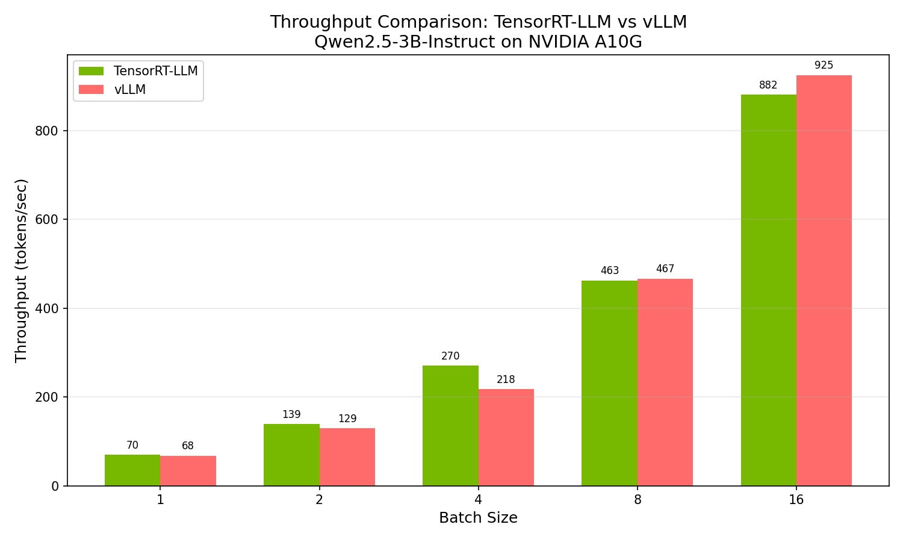
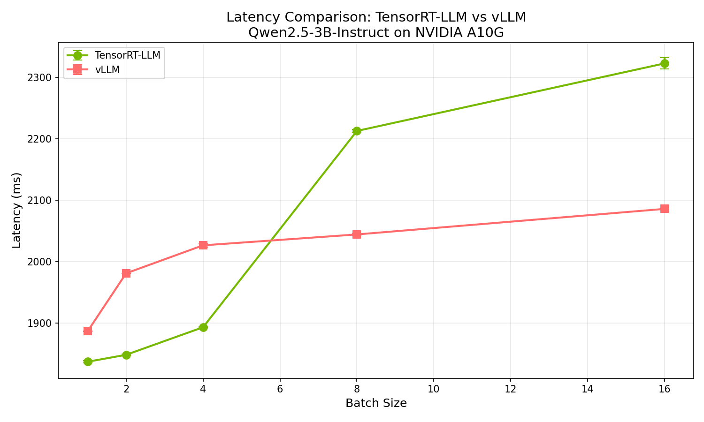

# Benchmark Results Summary

## Configuration
- **Model**: Qwen2.5-3B-Instruct
- **GPU**: NVIDIA A10G (24GB VRAM)
- **Instance**: AWS g5.xlarge
- **Dataset**: ShareGPT (100 prompts)
- **Max Output Tokens**: 128
- **Benchmark Runs**: 5

## Results

### Throughput (tokens/sec)

| Batch Size | TensorRT-LLM | vLLM | Difference |
|------------|--------------|------|------------|
| 1 | 69.69 | 67.85 | TRT +2.7% |
| 2 | 138.52 | 129.23 | TRT +7.2% |
| 4 | 270.47 | 218.02 | TRT +24.1% |
| 8 | 462.76 | 466.78 | vLLM +0.9% |
| 16 | 881.66 | 925.38 | vLLM +5.0% |

### Latency (ms)

| Batch Size | TensorRT-LLM | vLLM | Difference |
|------------|--------------|------|------------|
| 1 | 1836.81 | 1886.50 | TRT -2.6% |
| 2 | 1848.10 | 1980.90 | TRT -6.7% |
| 4 | 1892.99 | 2026.46 | TRT -6.6% |
| 8 | 2212.83 | 2044.20 | vLLM -7.6% |
| 16 | 2322.90 | 2085.84 | vLLM -10.2% |

## Visualizations

### Throughput Comparison

### Latency Comparison

## Key Findings

1. **Small Batch Sizes (1-4)**: TensorRT-LLM shows better throughput and lower latency
2. **Large Batch Sizes (8-16)**: vLLM shows better scaling and higher throughput
3. **Latency Consistency**: vLLM has more consistent latency (lower std deviation)
4. **Scaling Efficiency**: vLLM scales better from batch 1 to 16 (13.6x vs 12.7x)

## Notes

- SGLang benchmark failed due to CUDA compilation issues with flashinfer
- All tests used greedy decoding (temperature=0.0) for reproducibility
