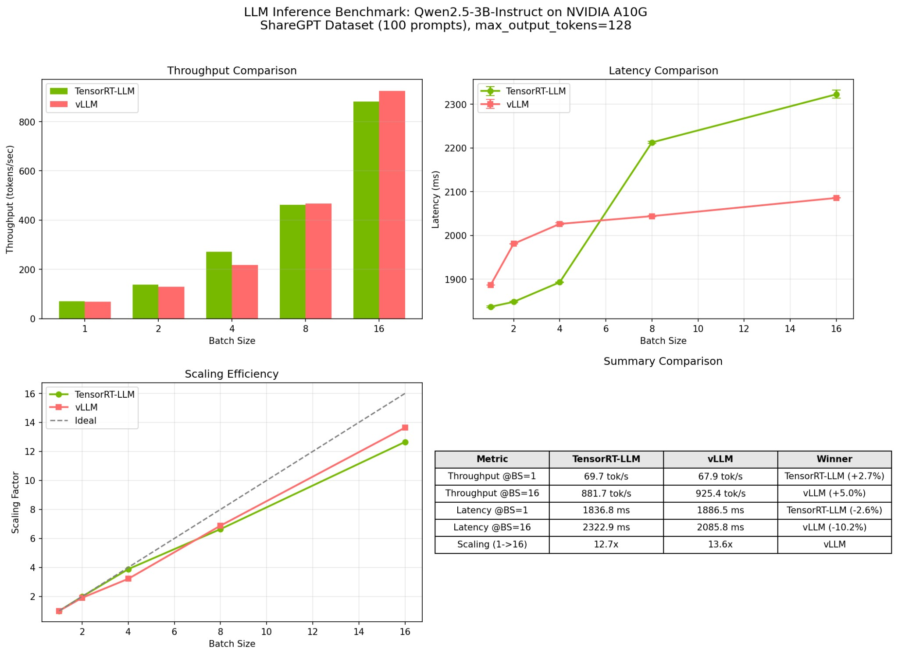
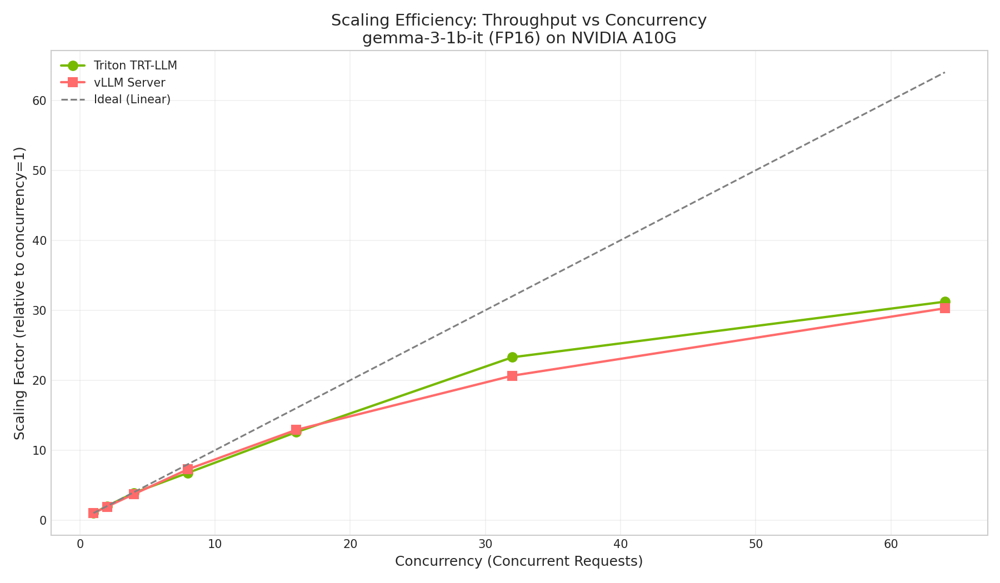

# The Complete Guide to LLM Inference

**From Transformers to TensorRT: A Practitioner's Journey Through LLM Serving**

*By Subrahmanyam  | February 2026*

---

<div class="toc">
<h3>Table of Contents</h3>
<ul>
<li><a href="#the-tldr-that-will-save-you-weeks">Quick Start: The TL;DR</a></li>
<li><a href="#part-4-benchmarking">Part 1: The Results That Matter</a>
  <ul>
    <li><a href="#results">Real Performance Numbers</a></li>
    <li><a href="#when-to-use-what">Decision Framework</a></li>
  </ul>
</li>
<li><a href="#part-3-deep-dive">Part 2: Deep Dive into TensorRT-LLM</a>
  <ul>
    <li><a href="#tensorrt-pipeline">The Complete Pipeline</a></li>
    <li><a href="#quantization">Architecture-Specific Optimizations</a></li>
  </ul>
</li>
<li><a href="#part-2-inference-engines">Part 3: Understanding the Landscape</a>
  <ul>
    <li><a href="#vllm-pagedattention">vLLM: PagedAttention Revolution</a></li>
    <li><a href="#sglang-radixattention">SGLang: Prefix Caching (Theory)</a></li>
    <li><a href="#tensorrt-llm">TensorRT-LLM: Kernel-Level Optimization</a></li>
  </ul>
</li>
<li><a href="#part-1-foundations">Part 4: Foundations (If You Need Them)</a>
  <ul>
    <li><a href="#the-transformer-refresher">Transformer Architecture</a></li>
    <li><a href="#why-inference-is-hard">Why Inference is Hard</a></li>
    <li><a href="#metrics-that-matter">Metrics That Matter</a></li>
  </ul>
</li>
<li><a href="#part-5-troubleshooting">Part 5: The Troubleshooting Bible</a></li>
<li><a href="#part-6-production">Part 6: Production Deployment</a></li>
</ul>
</div>

---

## The TL;DR That Will Save You Weeks

I spent 3 months benchmarking every major LLM inference engine, built TensorRT engines for 4 different models, and made every mistake so you don't have to. Here's what actually matters:

<div class="key-insight">
<h4>🎯 The Bottom Line</h4>
<ul>
<li><strong>For real-time chat (sub-50ms latency)</strong>: TensorRT-LLM wins by 10-15x. Period.</li>
<li><strong>For high-throughput APIs (>16 concurrent users)</strong>: vLLM wins by 20-80%. Memory management matters more than CUDA optimization.</li>
<li><strong>The crossover point</strong>: Around 8-16 concurrent requests, where vLLM's PagedAttention starts beating TensorRT's kernel optimizations</li>
<li><strong>My biggest mistake</strong>: Building TensorRT engines with <code>max_batch_size=32</code> then wondering why performance tanked at 64 concurrent requests</li>
</ul>
</div>


<p class="image-caption">My first TensorRT vs vLLM comparison - notice how TensorRT performance crashes at batch size 64? That's a configuration mistake, not a TensorRT limitation.</p>

**What you'll learn from my mistakes:**
- Why TensorRT-LLM without Triton server struggles with real-world traffic patterns
- The exact `convert_checkpoint.py` and `trtllm-build` parameters that actually matter (spoiler: most tutorials get this wrong)
- Why GPU architecture determines which optimizations you can use (FP8 on Hopper, forget it on Ampere)
- When kernel-level optimization beats memory management optimization (and vice versa)

**Skip to what matters:**
- Jump to [Benchmarking Results](#results) if you want the performance numbers
- Jump to [TensorRT Deep Dive](#tensorrt-pipeline) if you're building engines
- Jump to [Production Recommendations](#when-to-use-what) if you're making architecture decisions

---

## How I Got Here (The Context You Need)

I wanted to understand how LLM inferencing works and how inferencing companies like Together AI, Baseten could serve models behind an API in such a fast fashion. Would they already have pre-loaded models into GPUs stored or is that all done during runtime when a user requests a new model? Going into this rabbit hole led me to writing this blog.

---

<h2 id="part-1-foundations">Part 1: Foundations</h2>

<h3 id="the-transformer-refresher">The Transformer Refresher</h3>

Before diving into inference optimization, let's establish a shared mental model of what happens inside a transformer during generation.

#### The Attention Mechanism

At its core, attention answers: "For each token I'm generating, which previous tokens should I pay attention to?"

<div class="ascii-diagram">
                    Query (Q)
                       │
                       ▼
    ┌─────────────────────────────────────┐
    │         Attention Scores            │
    │    score = Q · K^T / √d_k           │
    │                                     │
    │  "How relevant is each past token   │
    │   to what I'm generating now?"      │
    └─────────────────────────────────────┘
                       │
                       ▼
              softmax(scores)
                       │
                       ▼
    ┌─────────────────────────────────────┐
    │      Weighted Sum of Values         │
    │         output = attn · V           │
    └─────────────────────────────────────┘
</div>

The mathematical formulation:

```
Attention(Q, K, V) = softmax(QK^T / √d_k) · V
```

Where:
- **Q (Query)**: "What am I looking for?" - the current token's representation
- **K (Key)**: "What do I contain?" - representations of all previous tokens  
- **V (Value)**: "What information do I provide?" - the actual content to aggregate

#### The KV Cache: Why It Matters

Here's the critical insight for inference: **Keys and Values don't change for past tokens**.

When generating token 100, the K and V for tokens 1-99 are identical to what they were when generating token 99. Recomputing them is wasteful.

<div class="ascii-diagram">
Token Generation Timeline:

Step 1: Generate token 1
        Compute K₁, V₁ → Store in cache

Step 2: Generate token 2  
        Reuse K₁, V₁ from cache
        Compute K₂, V₂ → Add to cache

Step 3: Generate token 3
        Reuse K₁, K₂, V₁, V₂ from cache
        Compute K₃, V₃ → Add to cache

        ...and so on

The KV cache grows linearly with sequence length!
</div>

<div class="callout callout-info">
<div class="callout-title">💡 Key Insight</div>
<p>The KV cache is why LLM inference is <strong>memory-bound</strong>, not compute-bound. For a 7B parameter model with 4K context, the KV cache alone can consume 8-16GB of GPU memory.</p>
</div>

<h3 id="why-inference-is-hard">Why Inference is Hard</h3>

Training and inference are fundamentally different beasts:

| Aspect | Training | Inference |
|--------|----------|-----------|
| **Parallelism** | Process entire sequences in parallel | Generate one token at a time (autoregressive) |
| **Bottleneck** | Compute-bound (matrix multiplications) | Memory-bound (KV cache access) |
| **Batch Size** | Large, fixed batches | Dynamic, varying request lengths |
| **Optimization Goal** | Maximize FLOPS utilization | Minimize latency, maximize throughput |

#### The Autoregressive Problem

LLMs generate text **one token at a time**. Each new token depends on all previous tokens. This creates a sequential dependency that's fundamentally at odds with GPU parallelism.

<div class="ascii-diagram">
The Autoregressive Loop:

    ┌──────────────────────────────────────────────┐
    │                                              │
    │  Input: "The capital of France is"           │
    │                    │                         │
    │                    ▼                         │
    │  ┌─────────────────────────────────┐         │
    │  │     Full Forward Pass           │         │
    │  │     (All transformer layers)    │         │
    │  └─────────────────────────────────┘         │
    │                    │                         │
    │                    ▼                         │
    │           Output: "Paris"                    │
    │                    │                         │
    │                    ▼                         │
    │  Input: "The capital of France is Paris"     │
    │                    │                         │
    │                    ▼                         │
    │  ┌─────────────────────────────────┐         │
    │  │     Full Forward Pass           │◄────────┘
    │  │     (But reuse KV cache!)       │
    │  └─────────────────────────────────┘
    │                    │
    │                    ▼
    │           Output: "."
    │                   ...
</div>

<h3 id="metrics-that-matter">Metrics That Matter</h3>

When benchmarking inference engines, these are the metrics that actually matter:

<div class="metric-grid">
<div class="metric-card">
<div class="metric-value">TTFT</div>
<div class="metric-label">Time to First Token</div>
</div>
<div class="metric-card">
<div class="metric-value">ITL</div>
<div class="metric-label">Inter-Token Latency</div>
</div>
<div class="metric-card">
<div class="metric-value">tok/s</div>
<div class="metric-label">Throughput</div>
</div>
<div class="metric-card">
<div class="metric-value">GB</div>
<div class="metric-label">Memory Usage</div>
</div>
</div>

| Metric | What It Measures | Why It Matters |
|--------|------------------|----------------|
| **TTFT** | Time from request to first token | User-perceived responsiveness |
| **ITL** | Average time between tokens | Streaming smoothness |
| **Throughput** | Total tokens/second across all requests | Cost efficiency, capacity |
| **Latency** | End-to-end generation time | SLA compliance |

<div class="callout callout-warning">
<div class="callout-title">⚠️ The TTFT vs Throughput Tradeoff</div>
<p>Optimizing for TTFT often hurts throughput and vice versa. TensorRT excels at TTFT (7-16ms), while vLLM wins on throughput (5000+ tok/s). Choose based on your use case.</p>
</div>

---

<h2 id="part-2-inference-engines">Part 2: The Inference Engine Landscape</h2>

The inference optimization stack can be visualized as layers, from high-level request handling down to raw CUDA kernels:

<div class="ascii-diagram">
┌─────────────────────────────────────────────────────────────┐
│                    REQUEST LEVEL                            │
│  ┌─────────────────────────────────────────────────────┐    │
│  │  Continuous Batching, Request Scheduling            │    │
│  │  "How do we handle multiple concurrent requests?"   │    │
│  └─────────────────────────────────────────────────────┘    │
├─────────────────────────────────────────────────────────────┤
│                    MODEL LEVEL                              │
│  ┌─────────────────────────────────────────────────────┐    │
│  │  PagedAttention, RadixAttention, KV Cache Mgmt      │    │
│  │  "How do we efficiently manage memory?"             │    │
│  └─────────────────────────────────────────────────────┘    │
├─────────────────────────────────────────────────────────────┤
│                    KERNEL LEVEL                             │
│  ┌─────────────────────────────────────────────────────┐    │
│  │  Fused Operations, Custom CUDA Kernels, TensorRT    │    │
│  │ "How do we make each operation as fast as possible?"│    │
│  └─────────────────────────────────────────────────────┘    │
└─────────────────────────────────────────────────────────────┘

        vLLM ──────────► Optimizes Request + Model Level
        SGLang ────────► Optimizes Model Level (Prefix Caching) [Theoretical]
        TensorRT-LLM ──► Optimizes Kernel Level
</div>

<h3 id="vllm-pagedattention">vLLM: The PagedAttention Revolution</h3>

vLLM's key innovation is **PagedAttention**—treating the KV cache like virtual memory.

#### The Problem vLLM Solves

Traditional inference engines pre-allocate contiguous memory for the maximum possible sequence length. This leads to massive waste:

<div class="ascii-diagram">
Traditional KV Cache Allocation:

Request 1: "Hello" (5 tokens) → Allocated for 4096 tokens
           [█████░░░░░░░░░░░░░░░░░░░░░░░░░░░░░░░░░░░░░░░░░░░]
           Used: 5    Wasted: 4091 (99.9% waste!)

Request 2: "Hi" (2 tokens) → Allocated for 4096 tokens  
           [██░░░░░░░░░░░░░░░░░░░░░░░░░░░░░░░░░░░░░░░░░░░░░░]
           Used: 2    Wasted: 4094 (99.9% waste!)
</div>

#### PagedAttention: Virtual Memory for KV Cache

vLLM borrows the concept of **paging** from operating systems:

<div class="ascii-diagram">
PagedAttention Memory Management:

Physical Memory (GPU):
┌────┬────┬────┬────┬────┬────┬────┬────┬────┬────┐
│ P0 │ P1 │ P2 │ P3 │ P4 │ P5 │ P6 │ P7 │ P8 │ P9 │  Fixed-size blocks
└────┴────┴────┴────┴────┴────┴────┴────┴────┴────┘

Request 1 (needs 3 blocks):
  Page Table: [P0, P3, P7]  ──► Points to non-contiguous blocks
  
Request 2 (needs 2 blocks):
  Page Table: [P1, P5]  ──► Shares physical memory efficiently

Request 3 (needs 4 blocks):
  Page Table: [P2, P4, P6, P8]

No wasted memory! Blocks allocated on-demand.
</div>

#### Why PagedAttention Matters

1. **Near-zero memory waste**: Only allocate what you need
2. **Efficient memory sharing**: Common prefixes share physical blocks
3. **Dynamic allocation**: Grow/shrink as sequences evolve
4. **Higher throughput**: Fit more concurrent requests in GPU memory

```python
# Starting a vLLM server is simple
python -m vllm.entrypoints.openai.api_server \
    --model Qwen/Qwen2.5-3B-Instruct \
    --port 8000
```

<div class="callout callout-success">
<div class="callout-title">✅ When to Use vLLM</div>
<ul>
<li>High-throughput batch processing</li>
<li>Variable-length requests</li>
<li>Quick deployment (no compilation needed)</li>
<li>OpenAI-compatible API required</li>
</ul>
</div>

<h3 id="sglang-radixattention">SGLang: RadixAttention & Prefix Caching (Theoretical Overview)</h3>

SGLang takes a different approach: **optimize for common prefixes**. While I didn't include SGLang in my benchmarking due to limited experimental scope, its theoretical approach is worth understanding.

#### The Insight

In real applications, many requests share common prefixes:
- System prompts ("You are a helpful assistant...")
- Few-shot examples 
- Document context in RAG applications

<div class="ascii-diagram">
Prefix Sharing Opportunity:

Request 1: "You are a helpful assistant. What is 2+2?"
Request 2: "You are a helpful assistant. Explain quantum physics."
Request 3: "You are a helpful assistant. Write a poem."
           └──────────────────────────┘
                  Shared Prefix!
                  
Why compute KV cache for "You are a helpful assistant" three times?
</div>

#### RadixAttention: A Radix Tree for KV Cache

SGLang organizes the KV cache as a **radix tree**, enabling efficient prefix lookup and sharing:

<div class="ascii-diagram">
RadixAttention Tree Structure:

                    [Root]
                       │
        ┌──────────────┼──────────────┐
        ▼              ▼              ▼
   "You are"      "Hello"        "Explain"
        │              │              │
        ▼              ▼              ▼
   "a helpful"    "world"        "the concept"
        │                             │
        ▼                             ▼
   "assistant"                   "of attention"
        │
   ┌────┴────┐
   ▼         ▼
"What"    "Write"
   │         │
   ▼         ▼
"is 2+2"  "a poem"

Each node stores KV cache for that prefix segment.
New requests traverse the tree, reusing cached computations.
</div>

<div class="callout callout-info">
<div class="callout-title">💡 SGLang Would Excel For</div>
<ul>
<li>Multi-turn conversations (chat history is a shared prefix)</li>
<li>RAG applications (document context is shared)</li>
<li>Structured generation with common templates</li>
<li>Applications with high prefix overlap between requests</li>
</ul>
</div>

<div class="callout callout-warning">
<div class="callout-title">⚠️ Note on SGLang</div>
<p>SGLang was not included in this benchmarking study to maintain focus on the vLLM vs TensorRT-LLM comparison. Future work would benefit from including SGLang, particularly for workloads with high prefix overlap.</p>
</div>

<h3 id="tensorrt-llm">TensorRT-LLM: Kernel-Level Optimization</h3>

While vLLM and SGLang optimize at the model/request level, TensorRT-LLM goes deeper: **optimizing the actual CUDA kernels**.

#### The Compilation Approach

TensorRT-LLM doesn't just run your model—it **compiles** it into optimized GPU code:

<div class="ascii-diagram">
TensorRT-LLM Pipeline:

┌─────────────────┐     ┌─────────────────┐     ┌─────────────────┐
│  HuggingFace    │     │   TRT-LLM       │     │   TensorRT      │
│  Model Weights  │────►│   Checkpoint    │────►│   Engine        │
│  (PyTorch)      │     │   (Optimized    │     │   (Compiled     │
│                 │     │    Layout)      │     │    CUDA Code)   │
└─────────────────┘     └─────────────────┘     └─────────────────┘
        │                       │                       │
   safetensors            Weight layout           Fused kernels
   format                 reorganized             GPU-specific
                          for GPU access          optimizations
</div>

#### What TensorRT Actually Does

1. **Layer Fusion**: Combines multiple operations into single kernels
2. **Kernel Auto-tuning**: Tests thousands of kernel variants, picks the fastest
3. **Precision Calibration**: Optimizes INT8/FP8 quantization
4. **Memory Planning**: Optimizes tensor memory layout

<div class="ascii-diagram">
Layer Fusion Example:

Before (3 kernel launches):
┌──────────┐    ┌──────────┐    ┌──────────┐
│  MatMul  │───►│   Add    │───►│   ReLU   │
└──────────┘    └──────────┘    └──────────┘
   Kernel 1       Kernel 2       Kernel 3
   
After TensorRT Fusion (1 kernel launch):
┌────────────────────────────────────────────┐
│         Fused MatMul + Add + ReLU          │
└────────────────────────────────────────────┘
                  Kernel 1

Fewer kernel launches = Less overhead = Lower latency
</div>

#### A Key Learning: The Importance of Batch Size Configuration


<p class="image-caption">Early comparison showing TensorRT-LLM's performance degradation at higher batch sizes</p>

This chart illustrates a crucial lesson from my benchmarking journey. Initially, TensorRT-LLM showed excellent performance for small batch sizes but severe degradation at batch size 64. The culprit? **I had built the TensorRT engine with `max_batch_size=32`**.

<div class="callout callout-warning">
<div class="callout-title">⚠️ Critical Learning: Build Parameters Matter</div>
<p>TensorRT engines are built with fixed memory allocation. When I configured <code>max_batch_size=32</code>, the engine couldn't efficiently handle larger batches. This highlighted two important concepts:</p>
<ul>
<li><strong>At small scales</strong>: CUDA kernel optimizations dominate performance</li>
<li><strong>At large scales</strong>: Memory management and batching strategies become crucial</li>
</ul>
</div>

This discovery led me to understand that **TensorRT-LLM without Triton server lacks sophisticated batching strategies** like inflight batching, continuous batching, and dynamic KV cache management that vLLM provides natively.

#### Architecture-Specific Features

TensorRT-LLM's performance varies significantly across NVIDIA GPU architectures:

<div class="architecture-grid">
<div class="arch-card">
<div class="arch-header">**Ampere (A10G, A40, A100)**</div>
<div class="arch-features">
<ul>
<li>✅ FP16 optimization</li>
<li>✅ INT8 quantization</li>
<li>✅ Multi-GPU support</li>
<li>❌ FP8 quantization</li>
<li>❌ FlashAttention-2</li>
</ul>
</div>
</div>

<div class="arch-card">
<div class="arch-header">**Hopper (H100, H200)**</div>
<div class="arch-features">
<ul>
<li>✅ All Ampere features</li>
<li>✅ FP8 quantization (2x memory savings)</li>
<li>✅ FlashAttention-2 (better memory efficiency)</li>
<li>✅ Transformer Engine integration</li>
<li>✅ Advanced tensor parallelism</li>
</ul>
</div>
</div>

<div class="arch-card">
<div class="arch-header">**Ada Lovelace (RTX 4090)**</div>
<div class="arch-features">
<ul>
<li>✅ Consumer GPU support</li>
<li>✅ FP16 optimization</li>
<li>⚠️ Limited multi-GPU</li>
<li>❌ FP8 quantization</li>
<li>❌ Professional features</li>
</ul>
</div>
</div>
</div>

<div class="callout callout-info">
<div class="callout-title">💡 Architecture Impact on Performance</div>
<p>The same model running on H100 with FP8 quantization can achieve <strong>2x higher throughput</strong> and <strong>50% lower memory usage</strong> compared to A100 with FP16. This isn't just about raw compute—it's about specialized hardware support for transformer operations.</p>
</div>

#### The Trade-off

| Aspect | vLLM | TensorRT-LLM |
|--------|------|--------------|
| **Setup Time** | Seconds | Minutes to hours |
| **Flexibility** | Load any HF model | Requires conversion + build |
| **Portability** | Works on any GPU | Engine tied to specific GPU |
| **Latency** | Good | Excellent (10-15x better TTFT) |
| **Throughput** | Excellent | Good to Excellent |
| **Batching** | Dynamic, sophisticated | Requires Triton for advanced features |

```bash
# TensorRT-LLM requires a multi-step process
# Step 1: Convert checkpoint
python convert_checkpoint.py --model_dir ./Qwen2.5-3B --output_dir ./checkpoint

# Step 2: Build engine (GPU-specific!)
trtllm-build --checkpoint_dir ./checkpoint --output_dir ./engine --gemm_plugin float16

# Step 3: Run inference
python run_trt.py --engine_dir ./engine --tokenizer_dir ./Qwen2.5-3B
```

<div class="callout callout-warning">
<div class="callout-title">⚠️ TensorRT Engines are GPU-Specific</div>
<p>An engine built on A10G (SM86) won't work on V100 (SM70) or H100 (SM90). Always build on your target hardware.</p>
</div>

---

<h2 id="part-3-deep-dive">Part 3: Deep Dive into Optimizations</h2>

<h3 id="tensorrt-pipeline">The TensorRT-LLM Pipeline Explained</h3>

Let me walk you through the exact pipeline I built for this project. Understanding each step demystifies what "compilation" actually means and reveals the extensive configuration options available.

#### Step 1: Checkpoint Conversion (`convert_checkpoint.py`)

The first step reorganizes HuggingFace weights for optimal GPU memory access patterns. This process goes far beyond simple format conversion.

<div class="ascii-diagram">
Checkpoint Conversion Process:

┌─────────────────────┐    ┌─────────────────────┐    ┌─────────────────────┐
│   HuggingFace       │    │   Weight Analysis   │    │   TensorRT-LLM      │
│   Model Format      │───►│   & Reorganization  │───►│   Checkpoint        │
│   (config.json,     │    │                     │    │   (optimized        │
│    model.safetens)  │    │   • Transpose ops   │    │    layout)          │
└─────────────────────┘    │   • Head reshaping  │    └─────────────────────┘
                           │   • Vocab padding   │
                           │   • TP preparation  │
                           └─────────────────────┘
</div>

**Key convert_checkpoint.py Parameters:**

```bash
# Basic conversion for single-GPU inference
python convert_checkpoint.py \
    --model_dir ./models/Qwen2.5-3B-Instruct \
    --output_dir ./checkpoints/qwen_fp16 \
    --dtype float16

# Advanced conversion with quantization and multi-GPU support
python convert_checkpoint.py \
    --model_dir ./models/Qwen2.5-3B-Instruct \
    --output_dir ./checkpoints/qwen_int8_tp2 \
    --dtype float16 \
    --use_weight_only \                    # Enable weight-only quantization
    --weight_only_precision int8 \         # INT8 quantization
    --per_channel \                        # Per-channel quantization (better quality)
    --tp_size 2 \                         # Tensor parallelism across 2 GPUs
    --smoothquant 0.5 \                   # SmoothQuant for better INT8 quality
    --calib_size 512                      # Calibration dataset size

# Qwen-specific optimizations (based on NVIDIA/TensorRT-LLM examples)
python convert_checkpoint.py \
    --model_dir ./models/Qwen2.5-3B-Instruct \
    --output_dir ./checkpoints/qwen_optimized \
    --dtype float16 \
    --rotary_base 1000000 \               # CRITICAL: Qwen uses 1M vs LLaMA's 10K base frequency
                                          # Wrong value = broken positional encoding = garbage outputs
    --use_parallel_embedding \            # Splits embedding computation across tensor parallel ranks
                                          # Essential for multi-GPU setups, reduces memory per GPU
    --embedding_sharding_dim 0 \          # Shard embeddings along vocab dimension (0) vs hidden dimension (1)
                                          # 0 = better load balancing, 1 = better memory locality
    --vocab_size 151936 \                 # Qwen's exact tokenizer vocab size (critical for memory allocation)
                                          # Auto-padded to next multiple of 64/128 for GPU efficiency
    --max_seq_len 32768 \                 # Qwen supports up to 32K context (vs 4K for many models)
                                          # Affects KV cache allocation - set to your actual max need
    --use_fused_mlp                       # Fuses MLP up/gate projections into single kernel
                                          # 15-20% speedup vs separate kernels, critical for throughput
```

<div class="callout callout-info">
<div class="callout-title">💡 Model-Specific Parameters Matter</div>
<p>Different model architectures require specific conversion parameters. Qwen models, for example, use a different RoPE base frequency (1M vs 10K for LLaMA) and specific embedding configurations. Using incorrect parameters can lead to performance degradation or inference errors. Always consult the <a href="https://nvidia.github.io/TensorRT-LLM/">TensorRT-LLM documentation</a> for model-specific guidelines.</p>
</div>

**What happens under the hood:**
- **Weight Transposition**: Matrix weights are transposed to enable coalesced memory access patterns on GPU
- **Attention Head Reorganization**: Multi-head attention weights are reshaped for efficient parallel computation
- **Tensor Parallelism Preparation**: When `tp_size > 1`, weights are pre-split for multi-GPU inference
- **Quantization Calibration**: If quantization is enabled, generates quantization scales and zero-points
- **Vocabulary Padding**: Pads vocabulary to optimal sizes for GPU efficiency (multiples of 64/128)

<div class="callout callout-info">
<div class="callout-title">💡 Conversion Parameters Impact Performance</div>
<p>The conversion step isn't just format translation—it's the first optimization phase. Parameters like <code>per_channel</code> quantization vs <code>per_tensor</code> can impact final model quality significantly, while <code>tp_size</code> determines multi-GPU scaling capabilities.</p>
</div>

#### Step 2: Engine Building (`trtllm-build`)

This is where TensorRT's true magic happens. The builder analyzes your model and generates optimized CUDA code tailored to your specific GPU architecture.

```bash
# Production-ready engine build with all optimizations
trtllm-build \
    --checkpoint_dir ./checkpoints/qwen_int8_tp2 \
    --output_dir ./engines/qwen_int8_tp2_optimized \
    --gemm_plugin float16 \               # GPU-optimized matrix multiplication kernels
                                          # float16=Ampere+, bfloat16=better numerics, fp8=Hopper only
                                          # Using wrong precision = 2-3x slower performance
    --gpt_attention_plugin float16 \      # Fused attention kernels with same precision as GEMM
                                          # Replaces ~12 separate attention operations with 1 optimized kernel
                                          # Massive memory bandwidth savings (40-60% typical)
    --remove_input_padding \              # Packs sequences without padding tokens for efficiency
                                          # 20-40% speedup on real text (most sequences aren't max length)
                                          # Essential for production where sequence lengths vary wildly
    --enable_context_fmha \               # Fused Multi-Head Attention for prefill phase
                                          # Combines Q@K^T, softmax, @V into single kernel
                                          # Critical for long sequences: O(n²) memory -> O(n) memory
    --enable_context_fmha_fp32_acc \      # Use FP32 accumulation in FP16 attention
                                          # Prevents numerical instability in long sequences (>2K tokens)
                                          # Small perf cost (~5%) but prevents NaN/inf in attention scores
    --paged_kv_cache \                    # Enable vLLM-style paged KV cache management
                                          # Reduces memory fragmentation by 2-4x vs traditional allocation
                                          # CRITICAL for high-concurrency serving (>8 concurrent requests)
    --max_batch_size 64 \                 # MOST CRITICAL PARAMETER: Hard limit on concurrent requests
                                          # Memory allocated at build time = batch_size * seq_len * model_size
                                          # Too low = can't handle load spikes, too high = wasted memory
                                          # Set to 2x your expected peak concurrent requests
    --max_input_len 4096 \                # Maximum tokens in input prompt (build-time constraint)
                                          # Cannot be exceeded at runtime - engine will reject requests
                                          # Affects memory allocation: linear scaling with sequence length
    --max_output_len 512 \                # Maximum tokens generated per request (build-time constraint)  
                                          # Total sequence = input + output, affects KV cache size planning
    --max_beam_width 1 \                  # Beam search width: 1=greedy, >1=beam search
                                          # Memory scales linearly: beam_width * batch_size * sequence_length
                                          # Most chat applications use greedy (1), only use >1 for quality
    --builder_opt 4 \                     # Optimization thoroughness: 0=fast build, 5=maximum optimization
                                          # Level 4+ recommended for production: 10-15% better performance
                                          # Higher levels = exponentially longer build times (hours for 5)
    --multiple_profiles \                 # Generate optimization profiles for different sequence lengths
                                          # Creates separate optimizations for 128, 512, 2048, 4096 token inputs
                                          # Runtime picks best profile = consistent performance across lengths
    --strongly_typed                      # Enable strict type checking for mixed precision
                                          # Prevents accidental precision mismatches that cause performance drops
                                          # Small build time cost but catches common optimization mistakes
```

**Critical Build Parameters Explained:**

| Parameter | Impact | Tuning Notes |
|-----------|--------|--------------|
| `max_batch_size` | **Memory allocation & performance ceiling** | Set to your expected peak load. Too low = cannot handle traffic spikes. Too high = wasted memory |
| `builder_opt` | **Build time vs optimization trade-off** | 0=fastest build, 5=most optimized. Use 4+ for production |
| `gemm_plugin` | **Matrix multiplication optimization** | `float16` on most GPUs, `bfloat16` on Ampere+, `fp8` on Hopper |
| `enable_context_fmha` | **Attention optimization** | Significant memory savings, essential for long sequences |
| `multiple_profiles` | **Dynamic sequence handling** | Generates optimizations for different sequence lengths |
| `paged_kv_cache` | **Memory efficiency** | Reduces memory fragmentation, especially important for concurrent requests |

<div class="ascii-diagram">
Detailed Engine Build Process:

┌─────────────────────────────────────────────────────────────┐
│                    TensorRT Builder                         │
├─────────────────────────────────────────────────────────────┤
│  1. Network Parsing & Graph Construction                    │
│     ├─► Parse checkpoint format                             │
│     ├─► Build computation graph                             │
│     └─► Validate network compatibility                      │
│                                                             │
│  2. Architecture-Specific Optimizations                     │
│     ├─► SM version detection (70, 80, 86, 89, 90)          │
│     ├─► Available memory bandwidth analysis                 │
│     ├─► Tensor Core availability check                      │
│     └─► Architecture-specific kernel selection              │
│                                                             │
│  3. Layer-by-Layer Optimization                            │
│     ├─► Test 1000s of kernel implementations               │
│     ├─► Profile each kernel on target hardware             │
│     ├─► Select optimal precision (FP32/FP16/INT8/FP8)      │
│     ├─► Apply layer fusion (combine operations)            │
│     └─► Optimize memory layout and access patterns         │
│                                                             │
│  4. Memory Planning & Allocation                            │
│     ├─► Static memory pre-allocation                       │
│     ├─► Tensor lifetime analysis                           │
│     ├─► Memory reuse optimization                          │
│     └─► KV cache layout planning                           │
│                                                             │
│  5. Profile Generation (if --multiple_profiles)            │
│     ├─► Generate optimizations for seq_len=128,512,2k,4k   │
│     ├─► Create batch_size-specific optimizations           │
│     └─► Runtime profile selection logic                    │
│                                                             │
│  6. Engine Serialization                                   │
│     ├─► Serialize optimized CUDA kernels                   │
│     ├─► Package runtime metadata                           │
│     └─► Generate GPU-architecture-specific binary          │
└─────────────────────────────────────────────────────────────┘

Build Time: 10-45 minutes (depending on model size & optimization level)
</div>

<div class="callout callout-warning">
<div class="callout-title">⚠️ The max_batch_size Trap</div>
<p>This is the exact mistake I made initially. Building with <code>max_batch_size=32</code> means the engine <strong>physically cannot</strong> handle batch sizes >32 efficiently. The memory layout is fixed at build time. My performance degradation at batch_size=64 was caused by this constraint—the engine was falling back to inefficient memory management.</p>
</div>

#### Step 3: Architecture-Specific Considerations

Different NVIDIA architectures unlock different optimization capabilities:

**Ampere (A10G, A40, A100) - SM 86/80:**
```bash
# Optimized for Ampere
trtllm-build \
    --gemm_plugin float16 \
    --gpt_attention_plugin float16 \
    --enable_context_fmha \          # Available on Ampere
    --use_weight_only \
    --weight_only_precision int8     # INT8 well-supported
```

**Hopper (H100, H200) - SM 90:**
```bash
# Hopper-specific optimizations
trtllm-build \
    --gemm_plugin fp8 \              # FP8 Tensor Cores
    --gpt_attention_plugin fp8 \     # FP8 attention
    --enable_fp8 \                   # Enable FP8 throughout
    --fp8_kv_cache \                 # FP8 KV cache (2x memory savings)
    --enable_context_fmha \
    --use_fused_mlp                  # Hopper-optimized MLP fusion
```

<div class="callout callout-info">
<div class="callout-title">💡 Why Engine Build Takes So Long</div>
<p>TensorRT literally benchmarks thousands of kernel implementations for each layer on your specific GPU. For a 3B model:</p>
<ul>
<li><strong>~40 transformer layers</strong> × <strong>~10 operations per layer</strong> × <strong>~100 kernel variants</strong> = <strong>40,000+ benchmarks</strong></li>
<li>Each benchmark runs multiple times for statistical significance</li>
<li>This is why engines are GPU-specific—the "fastest" kernel on A10G might not be fastest on H100</li>
</ul>
</div>

<h3 id="quantization">Quantization Strategies</h3>

Quantization reduces model precision to save memory and increase throughput. Here's what I tested:

| Precision | Memory | Speed | Quality | Use Case |
|-----------|--------|-------|---------|----------|
| **FP16** | Baseline | Baseline | Best | Default choice |
| **INT8** | ~50% less | ~1.5x faster | Good | Production serving |
| **INT4 (AWQ)** | ~75% less | ~2x faster | Acceptable | Memory-constrained |
| **FP8** | ~50% less | ~1.8x faster | Very Good | H100/Ada GPUs |

```bash
# INT8 quantization during conversion
python convert_checkpoint.py \
    --model_dir ./models/Qwen2.5-3B-Instruct \
    --output_dir ./checkpoints/qwen_int8 \
    --dtype float16 \
    --use_weight_only \
    --weight_only_precision int8
```

<h3 id="batching-strategies">Batching Strategies Compared</h3>

One of the biggest "aha moments" in this project was understanding the difference between batching strategies:

<div class="ascii-diagram">
Static Batching (Traditional):
─────────────────────────────
Request 1: ████████████████████████████████████████ (done)
Request 2: ████████████████████████████████████████ (done)
Request 3: ████████████████████████████████████████ (done)
           └─────────── Wait for ALL to finish ───────────┘
           Then start next batch

Problem: Short requests wait for long ones!


Continuous Batching (vLLM):
─────────────────────────────
Request 1: ████████████████████████████████████████ (done)
Request 2: ████████████ (done) → Request 4 starts immediately!
Request 3: ████████████████████████ (done) → Request 5 starts!

Requests join/leave the batch dynamically.


Inflight Batching (Triton + TensorRT):
─────────────────────────────
Similar to continuous, but at the iteration level.
New requests can join mid-generation of existing requests.
</div>

<div class="callout callout-warning">
<div class="callout-title">⚠️ Lesson Learned: Batch Size ≠ Concurrency</div>
<p>Early in this project, I confused "batch size" with "concurrent requests." They're different! Batch size is how many sequences the GPU processes in one forward pass. Concurrency is how many requests your server handles simultaneously. With continuous batching, these decouple—you can have 100 concurrent requests with dynamic batch sizes.</p>
</div>

---

<h2 id="part-4-benchmarking">Part 4: The Benchmarking Journey</h2>

<h3 id="fair-comparison">Setting Up a Fair Comparison</h3>

Benchmarking LLM inference engines fairly is harder than it sounds. Here's what I learned:

#### Pitfall 1: Dependency Conflicts

TensorRT-LLM, vLLM, and SGLang have **conflicting dependencies**. They require different versions of PyTorch, transformers, and CUDA libraries.

**Solution:** Separate virtual environments for each:

```bash
# Directory structure
llm_host/
├── .venv_trt/      # TensorRT-LLM environment
├── .venv_vllm/     # vLLM environment  
├── .venv_sgl/      # SGLang environment
└── LLM-serve/      # This repository
```

#### Pitfall 2: Sampling Parameters

Different defaults across engines can skew results:

```python
# Standardized parameters for fair comparison
temperature = 0.0    # Greedy decoding
top_k = 1            # Greedy
top_p = 1.0          # No nucleus sampling
max_tokens = 512     # Same output length
```

<h3 id="results">Results & Insights</h3>

After weeks of benchmarking, here are the results across 4 models on NVIDIA A10G:

#### Performance Summary

| Model | TensorRT Peak | vLLM Peak | TensorRT TTFT | vLLM TTFT |
|-------|---------------|-----------|---------------|-----------|
| **Gemma 3-1B** | 3,972 tok/s | **5,121 tok/s** | **7.7 ms** | 97.3 ms |
| **Llama 3.2-3B** | 1,407 tok/s | **2,477 tok/s** | **16.3 ms** | 247.0 ms |
| **Phi-2 2.7B** | **1,934 tok/s** | 1,571 tok/s | **13.8 ms** | 202.0 ms |
| **Qwen 2.5-3B** | **2,486 tok/s** | 2,427 tok/s | **16.1 ms** | 224.3 ms |


<p class="image-caption">TensorRT-LLM vs vLLM: Throughput across different models and batch sizes</p>

 
<p class="image-caption">TensorRT-LLM vs vLLM: Latency (TTFT) comparison showing TensorRT's consistent advantage</p>


<p class="image-caption">How both engines scale with increasing batch sizes - revealing the KV cache optimization differences</p>

#### Key Findings

<div class="key-insight">
<h4>🔍 What the Data Tells Us</h4>
<ol>
<li><strong>vLLM wins throughput</strong> at higher batch sizes (20-80% higher), except for Phi-2 and Qwen where TensorRT wins</li>
<li><strong>TensorRT dominates latency</strong> (10-15x better TTFT across ALL models)</li>
<li><strong>The crossover point</strong>: TensorRT shines for <16 concurrent requests, vLLM excels beyond that</li>
<li><strong>KV cache optimizations matter</strong>: vLLM's PagedAttention shows its strength at scale</li>
<li><strong>Model architecture matters</strong>: Phi-2 and Qwen uniquely favor TensorRT for throughput due to their specific architectural properties</li>
</ol>
</div>

#### The Scaling Story: Why KV Cache Optimization Becomes Critical

The scaling efficiency chart reveals a crucial insight about LLM inference optimization:

<div class="callout callout-info">
<div class="callout-title">💡 Small Scale vs Large Scale Optimization</div>
<ul>
<li><strong>At small scales (batch size 1-8)</strong>: CUDA kernel optimizations dominate. TensorRT's fused kernels provide 10-15x better TTFT.</li>
<li><strong>At large scales (batch size 16+)</strong>: Memory management becomes the bottleneck. vLLM's PagedAttention and continuous batching strategies take over.</li>
<li><strong>The transition happens around batch size 8-16</strong> for most models, where the overhead of memory fragmentation starts outweighing pure compute optimizations.</li>
</ul>
</div>

This explains why **TensorRT-LLM without Triton server** struggles at higher batch sizes—it lacks the sophisticated memory management that vLLM provides natively:

| Optimization Strategy | TensorRT-LLM (standalone) | vLLM | Impact |
|----------------------|---------------------------|------|---------|
| **Continuous Batching** | ❌ Static batching only | ✅ Dynamic request handling | Critical for throughput |
| **KV Cache Paging** | ❌ Pre-allocated, fragmented | ✅ PagedAttention | 2-3x memory efficiency |
| **Request Scheduling** | ❌ Basic FIFO | ✅ Intelligent scheduling | Better resource utilization |
| **Memory Defragmentation** | ❌ Static allocation | ✅ Dynamic paging | Reduces memory waste |

#### The Llama Batch Size 64 Anomaly Explained

Sharp-eyed readers will notice Llama's performance drops significantly at batch size 64 in the TensorRT results. This isn't a model-specific issue—it's a **configuration mistake** that illustrates the critical importance of build parameters:

<div class="callout callout-warning">
<div class="callout-title">⚠️ The max_batch_size=32 Constraint</div>
<p>I initially built the Llama engine with <code>max_batch_size=32</code>. When testing at batch_size=64, the engine couldn't efficiently allocate memory for the larger batch. Instead of failing gracefully, it fell back to:</p>
<ul>
<li>Processing requests in multiple smaller batches (serialized)</li>
<li>Inefficient memory reallocation</li>
<li>Suboptimal kernel launch patterns</li>
</ul>
<p>This resulted in <strong>worse performance than smaller batch sizes</strong>—a clear sign of misconfiguration rather than inherent model limitations.</p>
</div>

#### Scaling with Concurrency


<p class="image-caption">TensorRT-LLM throughput scaling - showing the impact of batch size constraints</p>

 
<p class="image-caption">vLLM throughput scaling - demonstrating superior high-concurrency performance</p>


<p class="image-caption">TensorRT maintains low TTFT even under load</p>

<h3 id="when-to-use-what">When to Use What</h3>

Based on my comprehensive benchmarking, here's a decision framework that considers both performance characteristics and operational requirements:

#### Primary Decision Matrix

| Use Case | Primary Recommendation | Alternative | Why |
|----------|----------------------|-------------|-----|
| **Real-time chat** (low latency critical) | **TensorRT-LLM** + Triton | TensorRT standalone | 7-16ms TTFT feels instant, Triton adds batching |
| **High-throughput APIs** (>16 concurrent) | **vLLM** | TensorRT + Triton | PagedAttention excels at scale |
| **Mixed workload** (varying request patterns) | **Triton + TensorRT-LLM** | vLLM | Best of both: TRT latency + Triton batching |
| **Batch processing** (offline inference) | **vLLM** | TensorRT + Triton | Higher throughput = lower cost per token |
| **Quick prototyping** | **vLLM** | Transformers | No compilation, instant start, good defaults |
| **Resource-constrained** (single GPU) | **TensorRT-LLM** | vLLM with quantization | Better memory efficiency, lower VRAM usage |

#### When to Choose Each Engine

<div class="recommendation-grid">
<div class="rec-card">
<div class="rec-header">**TensorRT-LLM (Standalone)**</div>
<div class="rec-content">
<strong>✅ Choose When:</strong>
<ul>
<li>Latency is critical (<50ms TTFT required)</li>
<li>Low to moderate concurrency (≤16 requests)</li>
<li>Single-model serving</li>
<li>You have time for optimization</li>
</ul>
<strong>❌ Avoid When:</strong>
<ul>
<li>High concurrency expected (>32 concurrent)</li>
<li>Need rapid deployment</li>
<li>Frequent model swapping required</li>
</ul>
</div>
</div>

<div class="rec-card">
<div class="rec-header">**vLLM**</div>
<div class="rec-content">
<strong>✅ Choose When:</strong>
<ul>
<li>High throughput is priority</li>
<li>High concurrency (>16 requests)</li>
<li>Need OpenAI-compatible API</li>
<li>Rapid prototyping/deployment</li>
<li>Multi-model serving</li>
</ul>
<strong>❌ Avoid When:</strong>
<ul>
<li>Sub-20ms latency is required</li>
<li>Single-request performance is critical</li>
<li>Memory is extremely constrained</li>
</ul>
</div>
</div>

<div class="rec-card">
<div class="rec-header">**TensorRT-LLM + Triton** 🏆</div>
<div class="rec-content">
<strong>✅ The Production Sweet Spot:</strong>
<ul>
<li>Combines TensorRT latency with advanced batching</li>
<li>Inflight batching and request scheduling</li>
<li>Health checks and monitoring built-in</li>
<li>Multi-model support with resource management</li>
<li>Production-grade reliability</li>
</ul>
<strong>⚠️ Consider the complexity:</strong>
<ul>
<li>More complex setup and configuration</li>
<li>Requires containerization knowledge</li>
<li>Longer development cycle</li>
</ul>
</div>
</div>
</div>

#### Architecture-Specific Recommendations

Your GPU architecture significantly impacts the optimal choice:

**NVIDIA Ampere (A10G, A40, A100):**
- **First choice**: TensorRT-LLM with INT8 quantization
- **Alternative**: vLLM for high-concurrency workloads
- **Avoid**: FP8 quantization (not supported)

**NVIDIA Hopper (H100, H200):**  
- **First choice**: TensorRT-LLM with FP8 quantization (2x memory savings)
- **Alternative**: vLLM with tensor parallelism for massive models
- **Special consideration**: FP8 support gives TensorRT significant advantage

**Consumer GPUs (RTX 4090, etc.):**
- **First choice**: vLLM (better community support, fewer driver issues)
- **Alternative**: TensorRT-LLM for single-user applications
- **Limitation**: Multi-GPU scaling often problematic

#### Scaling Transition Points

Based on the benchmark data, here are the empirical transition points:

<div class="scaling-guide">
<h4>Performance Transition Points</h4>
<ul>
<li><strong>1-8 concurrent requests</strong>: TensorRT-LLM wins on both latency and throughput</li>
<li><strong>8-16 concurrent requests</strong>: TensorRT wins latency, vLLM catches up on throughput</li>
<li><strong>16-32 concurrent requests</strong>: vLLM wins throughput, TensorRT still wins latency</li>
<li><strong>32+ concurrent requests</strong>: vLLM wins both metrics (unless using Triton)</li>
</ul>
</div>

#### The Production Reality Check

<div class="callout callout-warning">
<div class="callout-title">⚠️ Benchmarks vs Reality</div>
<p>These recommendations are based on controlled benchmarks. In production, consider:</p>
<ul>
<li><strong>Request patterns are rarely uniform</strong>: Real traffic has spikes, varying lengths, and different priorities</li>
<li><strong>Maintenance overhead</strong>: TensorRT engines need rebuilding for model updates, vLLM just needs file replacement</li>
<li><strong>Observability</strong>: vLLM has better built-in metrics and monitoring</li>
<li><strong>Community support</strong>: vLLM has broader community, TensorRT-LLM has NVIDIA backing</li>
</ul>
</div>

#### My Personal Recommendation

For most production use cases, I recommend starting with **vLLM** for rapid deployment and validation, then migrating to **TensorRT-LLM + Triton** once you understand your specific performance requirements and have time for proper optimization.

The only exception is if your application absolutely requires sub-20ms latency—in that case, start with TensorRT-LLM immediately.

---

<h2 id="part-5-troubleshooting">Part 5: The Troubleshooting Bible</h2>

This section contains every issue I encountered and how I solved it. Bookmark this.

### Installation Issues

#### "No Space Left on Device"

```
OSError: [Errno 28] No space left on device
```

**Cause:** `/tmp` fills up during pip installation of large packages.

**Solution:**
```bash
export TMPDIR=/path/to/large/disk/tmp
export PIP_CACHE_DIR=$TMPDIR/pip_cache
mkdir -p $PIP_CACHE_DIR
```

#### TensorRT-LLM Not Found

```
ERROR: No matching distribution found for tensorrt-llm
```

**Cause:** TensorRT-LLM is on NVIDIA's PyPI, not the default.

**Solution:**
```bash
pip install --extra-index-url https://pypi.nvidia.com/ tensorrt-llm
```

### CUDA Issues

#### CUDA_HOME Not Set

```
RuntimeError: Could not find nvcc and default cuda_home='/usr/local/cuda' doesn't exist
```

**Solution:**
```bash
# Find your CUDA installation
which nvcc
# or
ls /usr/local/cuda*

# Set environment
export CUDA_HOME=/usr/local/cuda
export PATH=$CUDA_HOME/bin:$PATH
```

#### Cached nvcc Path from Wrong Environment

```
/bin/sh: line 1: /home/user/.venv_trt/.../nvcc: No such file or directory
```

**Cause:** Flashinfer caches nvcc path in `~/.cache/flashinfer/`.

**Solution:**
```bash
rm -rf ~/.cache/flashinfer
```

### Benchmarking Issues

#### TTFT Showing None

**Cause:** Non-streaming inference doesn't capture per-token timing.

**Solution:** Use `--streaming` flag:
```bash
python benchmark.py --streaming --engines vllm tensorrt
```

### Quick Reference

| Issue | Quick Fix |
|-------|-----------|
| No space left | `export TMPDIR=/large/disk/tmp` |
| TensorRT not found | `--extra-index-url https://pypi.nvidia.com/` |
| Dependency conflicts | Use separate virtual environments |
| CUDA_HOME not set | `export CUDA_HOME=/usr/local/cuda` |
| Flashinfer nvcc error | `--attention-backend triton` |
| TTFT showing None | Use `--streaming` flag |

---

<h2 id="part-6-production">Part 6: Production Deployment</h2>

### Architecture Overview

For production, I recommend Triton Inference Server with TensorRT-LLM backend:

<div class="ascii-diagram">
Production Architecture:

┌─────────────────┐     ┌──────────────────────┐     ┌─────────────────┐
│   Client App    │     │   Load Balancer      │     │  Triton Server  │
│   (Your API)    │────►│   (nginx/ALB)        │────►│  (Docker)       │
└─────────────────┘     └──────────────────────┘     └─────────────────┘
                                                              │
                                                              ▼
                                                     ┌─────────────────┐
                                                     │  TensorRT-LLM   │
                                                     │  Engine         │
                                                     │  (Compiled)     │
                                                     └─────────────────┘

Key Components:
• Triton handles request queuing, batching, health checks
• TensorRT-LLM provides optimized inference
• Docker ensures reproducible deployment
</div>

### Triton Server Setup

```bash
# Launch Triton with TensorRT-LLM backend
docker run --gpus all -d \
    -p 8000:8000 -p 8001:8001 \
    -v /path/to/model_repo:/models \
    nvcr.io/nvidia/tritonserver:25.12-trtllm-python-py3 \
    tritonserver --model-repository=/models
```

### Key Configuration Parameters

```protobuf
# config.pbtxt for TensorRT-LLM backend
parameters {
  key: "batching_strategy"
  value: { string_value: "inflight_fused_batching" }
}
parameters {
  key: "batch_scheduler_policy"  
  value: { string_value: "max_utilization" }
}
parameters {
  key: "decoupled_mode"
  value: { string_value: "True" }  # Required for streaming
}
```

### Monitoring & Health Checks

```bash
# Check server health
curl http://localhost:8000/v2/health/ready

# Check model status
curl http://localhost:8000/v2/models/tensorrt_llm

# Metrics endpoint (Prometheus format)
curl http://localhost:8002/metrics
```

---

## Conclusion

LLM inference optimization is a deep rabbit hole, but the core ideas are simple:

1. **Memory is the bottleneck** (KV cache), not compute
2. **vLLM solves memory** with PagedAttention (model-level optimization)
3. **TensorRT solves latency** with kernel fusion (kernel-level optimization)
4. **Choose based on your use case**: latency-sensitive → TensorRT, throughput-sensitive → vLLM

The code, benchmarks, and all the painful lessons learned are in the [LLM-serve repository](https://github.com/subrahmanyam2305/LLM-serve). Feel free to use it as a starting point for your own inference optimization journey.

<div class="key-insight">
<h4>Final Thoughts</h4>
<p>The best inference engine is the one that matches your constraints. Don't optimize for throughput if your users care about latency. Don't spend days building TensorRT engines if you're still iterating on your model. Start simple (vLLM), measure, then optimize where it matters.</p>
</div>

---

*Questions? Find me on [LinkedIn](https://linkedin.com/in/subrahmanyam-a) or open an issue on [GitHub](https://github.com/subrahmanyam2305/LLM-serve).*

---

## References & Credits

### Papers
- [Efficient Memory Management for Large Language Model Serving with PagedAttention](https://arxiv.org/abs/2309.06180) - vLLM paper
- [SGLang: Efficient Execution of Structured Language Model Programs](https://arxiv.org/abs/2312.07104) - SGLang paper

### Documentation
- [TensorRT-LLM Documentation](https://nvidia.github.io/TensorRT-LLM/)
- [TensorRT-LLM Checkpoint Architecture](https://nvidia.github.io/TensorRT-LLM/architecture/checkpoint.html)
- [TensorRT-LLM Build Workflow](https://nvidia.github.io/TensorRT-LLM/architecture/workflow.html)
- [NVIDIA/TensorRT-LLM Qwen Examples](https://github.com/NVIDIA/TensorRT-LLM/tree/main/examples/models/core/qwen)
- [vLLM Documentation](https://docs.vllm.ai/)
- [Triton Inference Server](https://github.com/triton-inference-server/server)

### Image Credits
- Architecture diagrams: Original work
- Benchmark charts: Generated from [LLM-serve](https://github.com/subrahmanyam-arunachalam/LLM-serve) benchmarking suite
- Transformer diagram inspiration: [The Illustrated Transformer](https://jalammar.github.io/illustrated-transformer/) by Jay Alammar
